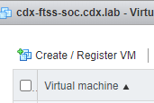
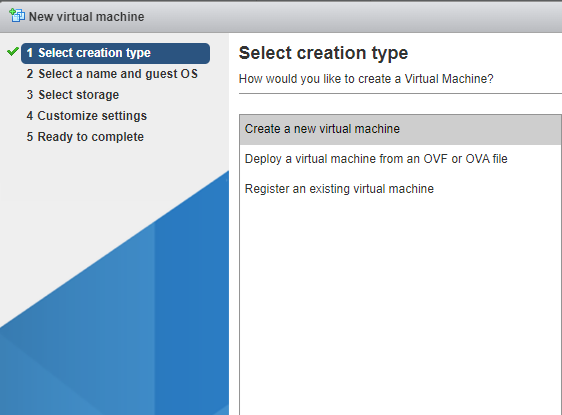

## 6.1 - vSphere: Building the PROTECT Node

We will start with the NIST CSF PROTECT node. For the purposes of this document, I will use the naming conventions referred to in the original Proxmox instructions from the Offensive Security Kali Linux community. The node in this section will be named "byzantium.kali.purple." This will be the enclave firewall. It will provide boundary protection, transparent HTTP proxy, DNS, and port forwarding services to the internal nodes of the SOC.

We will start with the NIST CSF PROTECT node. For the purposes of this document, I will use the naming conventions referred to in the original Proxmox instructions from the Offensive Security Kali Linux community. The node in this section will be named "byzantium.kali.purple." This will be the enclave firewall.

**NOTE 1** : You will need to have a system (physical or virtual) that will be able to access the firewall from its LAN (in my case, "SOC MGMT") interface to accomplish the web components of firewall configuration.

**NOTE 2** : One of the changes I made to the steps in this section was to consolidate all firewall modifications called for in the entire set of Proxmox instructions into this section, to eliminate the need for revisiting this node each time you are setting up another component of the SOC.

**NOTE 3** : As of the writing of this document, I have been unable to successfully compile Filebeat on OPNsense 23.7, so there will be no information regarding this process at this time.

**NOTE 4** : I have created enclaves and firewall rules that are not present in the Proxmox instructions. These are due to modifications I have made in this deployment (namely adding an enclave for analyst operations and preparing to receive external Elastic Agent traffic via the DMZ). Also, since I am not using a micro-segmented architecture, I will not configure any sub-interfaces. All rules meant for a sub-interface from the Proxmox instructions will be configured on the "SOC MGMT" interface in this setup. You will need to have a system (physical or virtual) that will be able to access the firewall from its LAN (in my case, "SOC MGMT") interface to accomplish the web components of firewall configuration.

    1. In the vSphere web interface, click "Create/Register VM…" 

Figure 1 – PROTECT – VMware vSphere: New VM in vSphere

2. Select "Create a new virtual machine." 

Figure 2 – PROTECT – VMware vSphere: Create a new virtual machine

3. At the "Select a name and guest OS" screen, enter "byzantium" as the name. For guest OS family choose "Linux." Select the highest available 64-bit Debian GNU version. 

Figure 3 – PROTECT – VMware vSphere: VM name and guest OS

4. At the "Select storage" screen, choose your desired available datastore. 

Figure 4 – PROTECT – VMware vSphere: Select datastore

5. At the "Customize settings" screen, modify the VM settings in line with the requirements of this node: 2 CPUs, 2 GB RAM, 1 x 128 GB HDD, 3 NICs (OPNET NIC is optional). Ensure that the WAN interface is connected to a network that has Internet connectivity (and preferably DHCP, though not necessary). 

Figure 5 – PROTECT – VMware vSphere: Customize settings

6. Configure the hard drive for thin provisioning. 

Figure 6 – PROTECT – VMware vSphere: Customize hard disk settings

7. For the CD/DVD, choose "Datastore ISO file" and navigate to your OPNsense ISO within your datastore and click "Select." Ensure that the ISO is configured to "Connect at power on." 

Figure 7 – PROTECT – VMware vSphere: ISO selection 

Figure 8 – PROTECT – VMware vSphere: Connect CD/DVD Drive at power on

Click "Finish" to create the virtual machine.